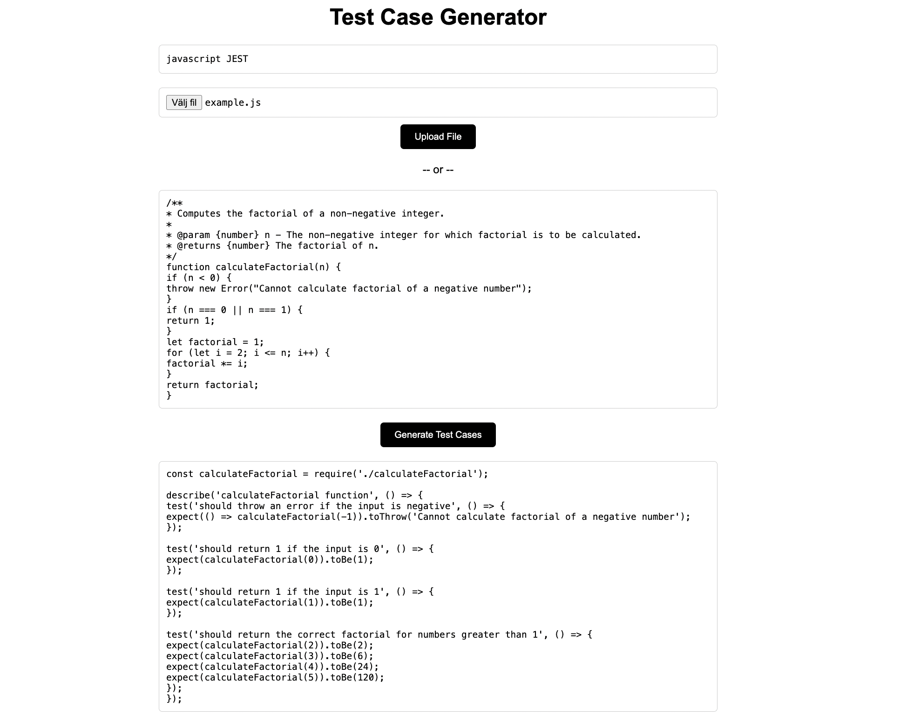

# Test Case Generator - Master Thesis project

This project is a simple one-page website that generates test cases for code snippets using the OpenAI API.

## Installation
To start using the Test Case Generator, start by cloning the repository and nagivate to the project directory locally. Then install dependencies using 

`npm install`

Once the installation is complete, you can start the server using the following command:

`node server.mjs`

This will start the server on http://localhost:3000.

## How It Works

1. Specify the programming language to use and a prefered test-library if applicable (can be omitted)
2. Upload a file containing a code snippet OR write code in the text box.  
*A few example code files are provided in the folder "example_files"*

3. Click on 'Generate Test Cases' and the server will generate test cases for the provided code using the OpenAI API
4. The generated test cases will be displayed in the second text box 
5. Copy the provided test cases and use in your workspace

## Example

